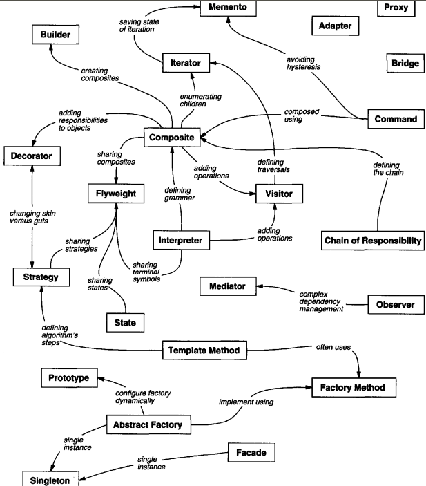
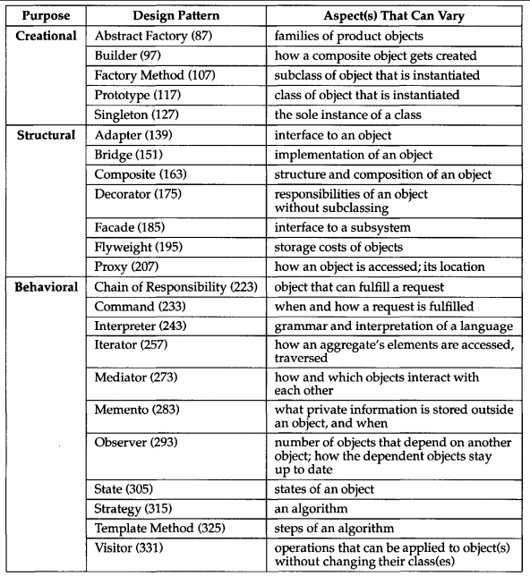

# design_patterns_interview_preparation
By now you already know what "interview preparation" repos are about, so enjoy.

## Theorical Questions Section

### Theorical Question 1

Do you know what the MVC model is ?

<b>Answer</b>

MVC consists of three kinds of objects. The Model is the application object, the View is
its screen presentation, and the Controller defines the way the user interface reacts to
user input. Before MVC, user interface designs tended to lump these objects together.
MVC decouples them to increase flexibility and reuse.

MVC decouples views and models by establishing a subscribe/notify protocol between
them. A view must ensure that its appearance reflects the state of the model. Whenever
the model's data changes, the model notifies views that depend on it. In response, each
view gets an opportunity to update itself. This approach lets you attach multiple views
to a model to provide different presentations. You can also create new views for a model
without rewriting it.

<b>Source</b>

Design Patterns: Elements of Reusable Object-Oriented Software - pag 4

### Theorical Question 2

What desing patterrns do you know ?

<b>Answer</b>

Abstract Factory (87) Provide an interface for creating families of related or dependent
objects without specifying their concrete classes.

Adapter (139) Convert the interface of a class into another interface clients expect.
Adapter lets classes work together that couldn't otherwise because of incompat-
ible interfaces.

Bridge (151) Decouple an abstraction from its implementation so that the two can vary
independently.

Builder (97) Separate the construction of a complex object from its representation so
that the same construction process can create different representations.

Chain of Responsibility (223) Avoid coupling the sender of a request to its receiver by
giving more than one object a chance to handle the request. Chain the receiving
objects and pass the request along the chain until an object handles it.

Command (233) Encapsulate a request as an object, thereby letting you parameter-
ize clients with different requests, queue or log requests, and support undoable
operations.

Composite (163) Compose objects into tree structures to represent part-whole hierar-
chies. Composite lets clients treat individual objects and compositions of objects
uniformly.

Decorator (175) Attach additional responsibilities to an object dynamically. Decorators
provide a flexible alternative to subclassing for extending functionality.

Facade (185) Provide a unified interface to a set of interfaces in a subsystem. Facade
defines a higher-level interface that makes the subsystem easier to use.

Factory Method (107) Define an interface for creating an object, but let subclasses de-
cide which class to instantiate. Factory Method lets a class defer instantiation to
subclasses.

Flyweight (195) Use sharing to support large numbers of fine-grained objects effi-
ciently.

Interpreter (243) Given a language, define a represention for its grammar along with
an interpreter that uses the representation to interpret sentences in the language.

Iterator (257) Provide a way to access the elements of an aggregate object sequentially
without exposing its underlying representation.

Mediator (273) Define an object that encapsulates how a set of objects interact. Me-
diator promotes loose coupling by keeping objects from referring to each other
explicitly, and it lets you vary their interaction independently.

Memento (283) Without violating encapsulation, capture and externalize an object's
internal state so that the object can be restored to this state later.

Observer (293) Define a one-to-many dependency between objects so that when one
object changes state, all its dependents are notified and updated automatically.

Prototype (117) Specify the kinds of objects to create using a prototypical instance, and
create new objects by copying this prototype.

Proxy (207) Provide a surrogate or placeholder for another object to control access to
it.

Singleton (127) Ensure a class only has one instance, and provide a global point of
access to it.

State (305) Allow an object to alter its behavior when its internal state changes. The
object will appear to change its class.

Strategy (315) Define a family of algorithms, encapsulate each one, and make them
interchangeable. Strategy lets the algorithm vary independently from clients that
use it.

Template Method (325) Define the skeleton of an algorithm in an operation, deferring
some steps to subclasses. Template Method lets subclasses redefine certain steps
of an algorithm without changing the algorithm's structure.

Visitor (331) Represent an operation to be performed on the elements of an object
structure. Visitor lets you define a new operation without changing the classes of
the elements on which it operates.

<b>Source</b>

Design Patterns: Elements of Reusable Object-Oriented Software - pag 8

### Theorical Question 3

Do you know the relantionships between the design patterns ?

<b>Answer</b>

<b>Source</b>

Design Patterns: Elements of Reusable Object-Oriented Software - pag 13

### Theorical Question 4

Do you know what dynamic binding is ?

<b>Answer</b>

When a request is sent to an object, the particular operation that's performed depends on
both the request and the receiving object. Different objects that support identical requests
may have different implementations of the operations that fulfill these requests. The
run-time association of a request to an object and one of its operations is known as
dynamic binding.

Dynamic binding means that issuing a request doesn't commit you to a particular
implementation until run-time. Consequently, you can write programs that expect an
object with a particular interface, knowing that any object that has the correct interface
will accept the request. Moreover, dynamic binding lets you substitute objects that
have identical interfaces for each other at run-time. This substitutability is known as
polymorphism, and it's a key concept in object-oriented systems. It lets a client object
make few assumptions about other objects beyond supporting a particular interface.
Polymorphism simplifies the definitions of clients, decouples objects from each other,
and lets them vary their relationships to each other at run-time.

<b>Source</b>

Design Patterns: Elements of Reusable Object-Oriented Software - pag 13

### Theorical Question 5

How would you avoid Creating an object by specifying a class explicitly and why would you want to avoid that ?

<b>Answer</b>

Creating an object by specifying a class explicitly. Specifying a class name when
you create an object commits you to a particular implementation instead of a
particular interface. This commitment can complicate future changes. To avoid it,
create objects indirectly.
Design patterns: Abstract Factory (87), Factory Method (107), Prototype (117).

<b>Source</b>

Design Patterns: Elements of Reusable Object-Oriented Software - pag 24

### Theorical Question 6

How would you avoid Dependence on specific operations and why would you want to avoid that ?

<b>Answer</b>

Dependence on specific operations. When you specify a particular operation, you
commit to one way of satisfying a request. By avoiding hard-coded requests, you
make it easier to change the way a request gets satisfied both at compile-time and
at run-time.
Design patterns: Chain of Responsibility (223), Command (233).

<b>Source</b>

Design Patterns: Elements of Reusable Object-Oriented Software - pag 24

### Theorical Question 7

How would you avoid Dependence on hardware and software platform and why would you want to avoid that ?

<b>Answer</b>

Dependence on hardware and software platform. External operating system interfaces
and application programming interfaces (APIs) are different on different hard-
ware and software platforms. Software that depends on a particular platform will
be harder to port to other platforms. It may even be difficult to keep it up to date
on its native platform. It's important therefore to design your system to limit its
platform dependencies.
Design patterns: Abstract Factory (87), Bridge (151).

<b>Source</b>

Design Patterns: Elements of Reusable Object-Oriented Software - pag 24

### Theorical Question 8

How would you avoid Dependence on object representations or implementations and why would you want to avoid that ?

<b>Answer</b>

Dependence on object representations or implementations. Clients that know how an
object is represented, stored, located, or implemented might need to be changed
when the object changes. Hiding this information from clients keeps changes
from cascading.
Design patterns: Abstract Factory (87), Bridge (151), Memento (283), Proxy (207).

<b>Source</b>

Design Patterns: Elements of Reusable Object-Oriented Software - pag 24

### Theorical Question 9

How would you avoid Algorithmic dependencies and why would you want to avoid that ?

<b>Answer</b>

Algorithmic dependencies. Algorithms are often extended, optimized, and replaced
during development and reuse. Objects that depend on an algorithm will have
to change when the algorithm changes. Therefore algorithms that are likely to
change should be isolated.
Design patterns: Builder (97), Iterator (257), Strategy (315), Template
Method (325), Visitor (331).

<b>Source</b>

Design Patterns: Elements of Reusable Object-Oriented Software - pag 24

### Theorical Question 10

How would you avoid Tight coupling and why would you want to avoid that ?

<b>Answer</b>

Tight coupling. Classes that are tightly coupled are hard to reuse in isolation, since
they depend on each other. Tight coupling leads to monolithic systems, where
you can't change or remove a class without understanding and changing many other classes. 

The system becomes a dense mass that's hard to learn, port, and maintain.
Loose coupling increases the probability that a class can be reused by itself and
that a system can be learned, ported, modified, and extended more easily. Design
patterns use techniques such as abstract coupling and layering to promote loosely
coupled systems.
Design patterns: Abstract Factory (87), Bridge (151), Chain of Responsibility (223),
Command (233), Facade (185), Mediator (273), Observer (293).

<b>Source</b>

Design Patterns: Elements of Reusable Object-Oriented Software - pag 24

### Theorical Question 11

How would you avoid Extending functionality by subclassing and why would you want to avoid that ?

<b>Answer</b>

Extending functionality by subclassing. Customizing an object by subclassing often
isn't easy. Every new class has a fixed implementation overhead (initialization,
finalization, etc.). Defining a subclass also requires an in-depth understanding of
the parent class. For example, overriding one operation might require overriding
another. An overridden operation might be required to call an inherited operation.
And subclassing can lead to an explosion of classes, because you might have to
introduce many new subclasses for even a simple extension.

Object composition in general and delegation in particular provide flexible alter-
natives to inheritance for combining behavior. New functionality can be added to
an application by composing existing objects in new ways rather than by defining
new subclasses of existing classes. On the other hand, heavy use of object com-
position can make designs harder to understand. Many design patterns produce
designs in which you can introduce customized functionality just by defining one
subclass and composing its instances with existing ones.
Design patterns: Bridge (151), Chain of Responsibility (223), Composite (163),
Decorator (175), Observer (293), Strategy (315).

<b>Source</b>

Design Patterns: Elements of Reusable Object-Oriented Software - pag 24

### Theorical Question 12

How would you avoid Inability to alter classes conveniently and why would you want to avoid that ?

<b>Answer</b>

Inability to alter classes conveniently. Sometimes you have to modify a class that
can't be modified conveniently. Perhaps you need the source code and don't have
it (as may be the case with a commercial class library). Or maybe any change
would require modifying lots of existing subclasses. Design patterns offer ways
to modify classes in such circumstances.
Design patterns: Adapter (139), Decorator (175), Visitor (331).

<b>Source</b>

Design Patterns: Elements of Reusable Object-Oriented Software - pag 24

### Theorical Question 12

Desing pattern are a way of handling evolution of software. What variable is the one that could change to consider each design pattern ?

<b>Answer</b>

<b>Source</b>

Design Patterns: Elements of Reusable Object-Oriented Software - pag 24

